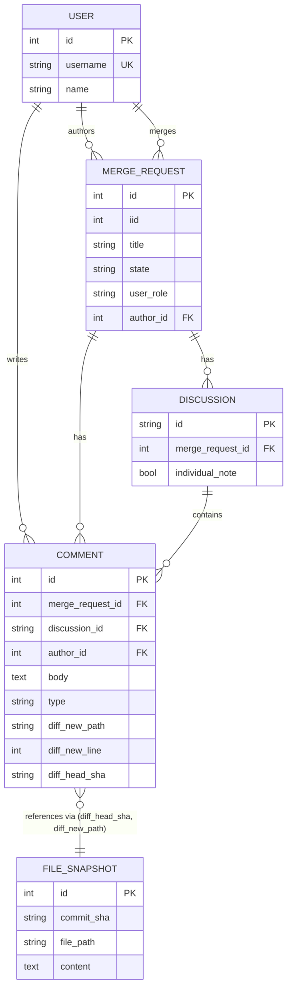

# MR History

Browse your GitLab merge request history with inline diff context. Fetches MRs, discussions, comments, and file snapshots via the GitLab API, stores them in SQLite, and serves a dark-themed web UI for browsing.

## Features

- **List view** — filter by state (merged/open/closed), role (assignee/reviewer), label, full-text search, sort options, paginated
- **Detail view** — MR metadata, description rendered as markdown, threaded or flat comment views
- **Diff context** — inline comments show the file path, line number, and a code context block with the target lines highlighted in blue
- **File snapshots** — fetches the full file content at the commit each comment was made on, so you see exactly what the reviewer saw

## Quick start

### Prerequisites

- Python ≥ 3.11
- [uv](https://docs.astral.sh/uv/)
- [glab CLI](https://gitlab.com/gitlab-org/cli) authenticated (`glab auth login`)

### 1. Fetch data

```bash
# Fetch MRs where you are assignee or reviewer
uv run python -m mr_history.fetch_mrs

# Fetch discussions (includes diff position data for inline comments)
uv run python -m mr_history.fetch_discussions

# Fetch file content at each commented commit (for code context)
uv run python -m mr_history.fetch_file_snapshots
```

Each script accepts `--db` (default: `mr_history.db`) and is idempotent — re-running only fetches new/changed records.

### 2. Start the web UI

```bash
# Dev mode
uv run python -m mr_history.app --debug

# Or via entry point
uv run mr-history-serve --debug

# Production (requires gunicorn: uv add gunicorn)
uv run mr-history-serve --prod --host 0.0.0.0 --port 5111
```

Open http://127.0.0.1:5111

## Configuration

Project and user IDs are resolved automatically:

1. **Env vars** (explicit override): `MR_HISTORY_PROJECT_ID`, `MR_HISTORY_USER_ID`
2. **`--repo` flag**: `--repo hugo-systems/practice-manager-orthodontics`
3. **Git remote**: if run from inside a GitLab-cloned repo, derives `group/project` from `origin` remote
4. **User ID**: derived from `glab auth` (the authenticated glab user)

If none resolve, scripts exit with an error message.

## Architecture

```
fetch_mrs.py ──→ SQLite DB ←── mr_history/app.py ──→ Web UI
fetch_discussions.py ──↗     ↖── fetch_file_snapshots.py
```

### Data flow

1. **`fetch_mrs.py`** — calls `/merge_requests?assignee_id=X` and `/merge_requests?reviewer_id=X`, upserts MRs and users
2. **`fetch_discussions.py`** — calls `/merge_requests/:iid/discussions`, upserts discussions and comments with diff position data (file path, line numbers, commit SHAs)
3. **`fetch_file_snapshots.py`** — for each unique `(commit_sha, file_path)` from diff comments, calls `/repository/files/:path?ref=:sha`, stores full file content
4. **`app.py`** — Flask web app queries SQLite, renders templates with markdown and code context

### ERD



## Project structure

```
mr_history/
├── __init__.py
├── app.py                  # Flask web UI
├── models.py               # SQLAlchemy models
├── templates/
│   ├── base.html
│   ├── list.html
│   └── detail.html
├── static/                 # (reserved for extracted CSS)
├── fetch_mrs.py            # Fetch MRs from GitLab
├── fetch_discussions.py    # Fetch discussions + diff positions
└── fetch_file_snapshots.py # Fetch file content at commits
```

## License

MIT
